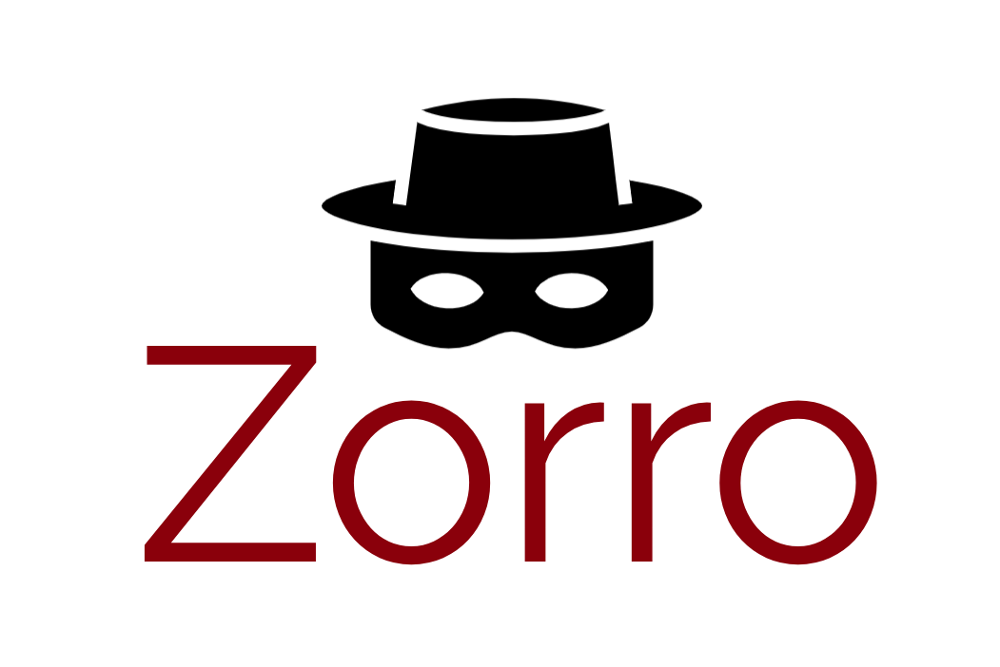

  
  
 Grammar test suite for masked language models.

## Update October, 2021

The version of Zorro used to evaluate BabyBERTa in the paper
[BabyBERTa: Learning more grammar with small-scale child directed language](https://aclanthology.org/2021.conll-1.49/) published in the proceedings of CoNLL2021
is out-of-date. This repository contains an updated version with title-cased proper nouns, 
and different parings of content words. 
To use the version used by the authors, please refer to the commit tagged "CoNLL2021".

## About

Inspired by [BLiMP](https://arxiv.org/pdf/1912.00582.pdf), 
`Zorro` is a Python project for creating minimal pairs that exhibit a variety of grammatical contrasts, 
for quantifying the grammatical knowledge of masked language models.

Sentences are created using templates, filled with words from custom, human-curated word lists. 
There are 13 phenomena, each consisting of one or more paradigms:
1. determiner-subject agreement: across prepositional phrase, or relative clause; in 1 or 2 verb question
2. subject-verb agreement: across 0, 1, or 2 adjectives
3. anaphor agreement: gender
4. argument structure: dropped arguments, swapped arguments, transitive
5. binding: principle A
6. case: subjective pronoun  (not in BLiMP)
7. ellipsis: N-bar
8. filler-gap: wh-question object, or subject
9. irregular: verb
10. island-effects: adjunct, coordinate_structure_constraint 
11. local attractor: in question with auxiliary (not in BLiMP)
12. NPI licensing: "only" licensor
13. quantifiers: existential there, superlative

The data is located in `sentences/babyberta`. 
Each text file represents one paradigm, and contains 4,000 sentences making up 2,00 minimal pairs.

The grammatical correctness of each sentence is determined by its position in the text file:
- sentences on odd numbered lines (1, 3, etc.) are un-grammatical
- sentences on even numbered lines (2, 4, etc.) are grammatical

## How words were chosen

Words that make up test sentences are all derived from frequent nouns, verbs and adjectives in 5M words of child-directed speech, 
5M words of child-directed written text from the Newsela corpus, and 10M words of adult-directed written text from English Wikipedia.

Note: All words were derived from whole-words in the BPE vocabulary of [BabyBERTa](https://github.com/phueb/BabyBERTa) trained using the Python `tokenizers` package on the above corpora. 
Because BabyBERTa is trained on lower-cased data, all words in test sentences, except for proper nouns, are lower-cased. 

1. Using `script/tag_and_count_vocab_words.py`, we removed any word that is:
- not a whole word in original corpus files (it is a sub-word)
- not in th English dictionary
- a Stanford CoreNLP stop-word

2. Using `scripts/chose_legal_words.py`, we:
- automatically retrieved words tagged with desired POS
- manually tagged words as legal or illegal

## Development

Currently, information about each sentence's template is saved, but is unused.
It may be useful to use information about a sentence's template for more in-depth analyses,
 such as breaking down performance by singular vs. plural noun or verb.

## Advanced

### To make test sentences based on your own vocabulary:

1. get vocab from which words will be chosen for inclusion in test sentences using `scripts/tag_and_count_vocab_words.py`
2. chose words to be included by part-of-speech using `scripts/chose_legal_words.py`
2. make and save test sentences using `scripts/make_sentences.py`

### To score predictions made by your models:

Use [UnMasked](https://github.com/phueb/UnMasked) to load a custom model from the `huggingface` model hub.
The evaluation script is located in `UnMasked/scripts/score_model_from_repo.py`
 

